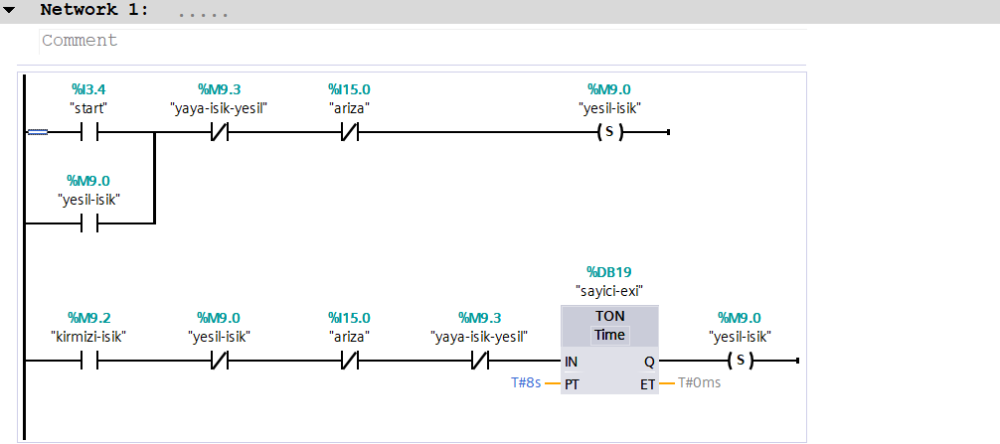
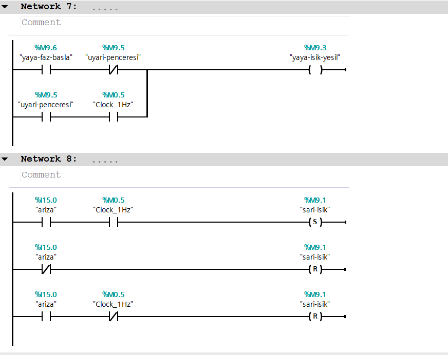

when the system on, green light stays on for 10 seconds, after the green light turn off, yellow light stays on for 3 seconds. After the yellow light turn on, red light stays on for 8 seconds. In this sequence pedesterian light become green and stays on just like the red light.but during the last 2 seconds of that period, the pedestrian light blink
[Açıklama](Ekran-görüntüsü-2026-09-07-162654.png)
[Açıklama](Ekran-görüntüsü-2026-09-07-162708.png)

