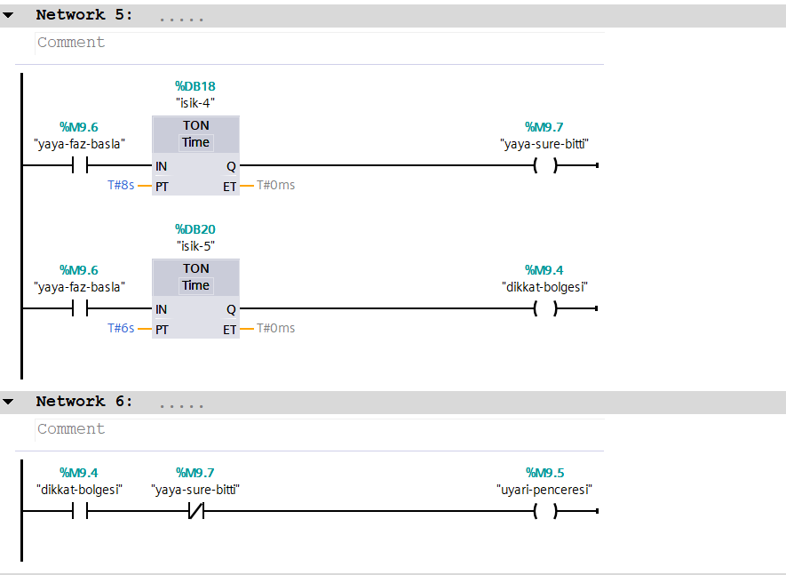

when the system on, green light stays on for 10 seconds
after the green light turn off, yellow light stays on for 3 seconds.[Açıklama](screenshot2.png)
After the yellow light turn on, red light stays on for 8 seconds.[Açıklama](screenshot3.png)
In this sequence pedesterian light become green and stays on just like the red light.
ut during the last 2 seconds of that period, the pedestrian light blink
